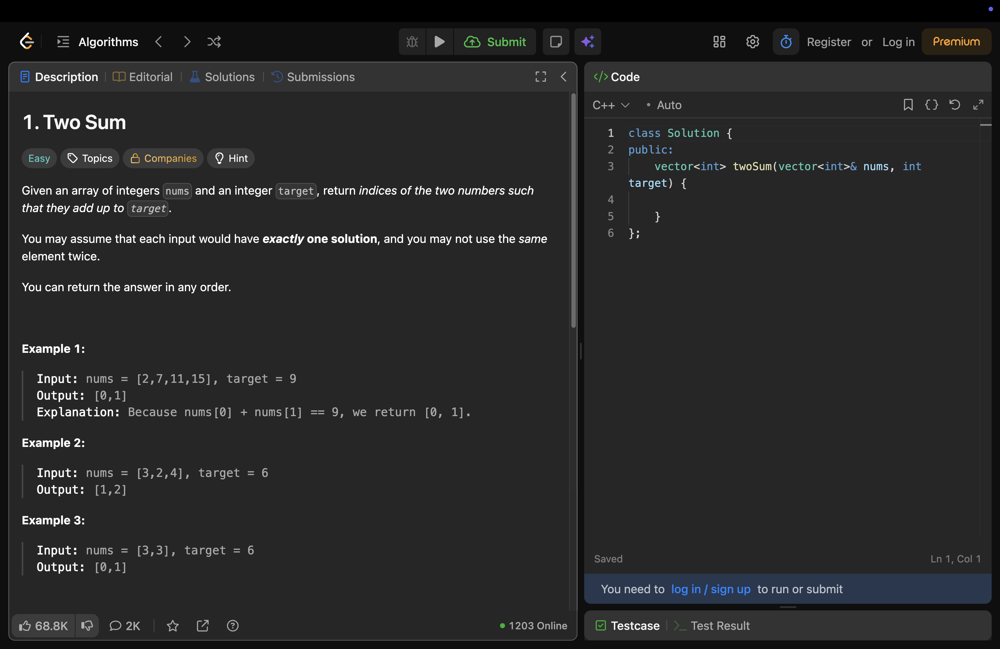
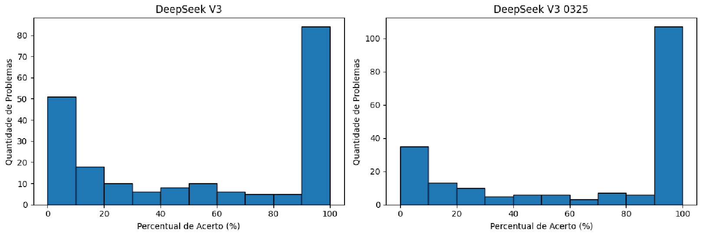
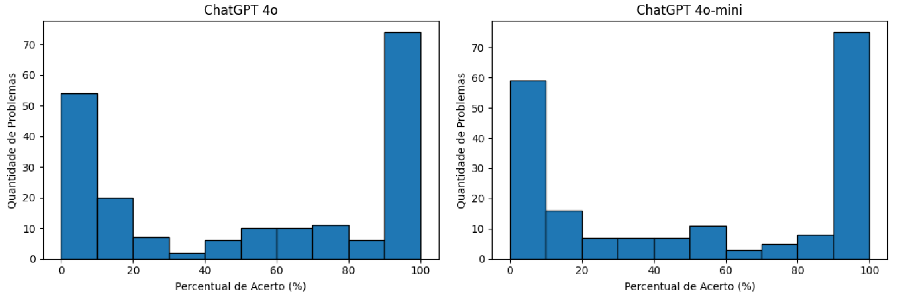
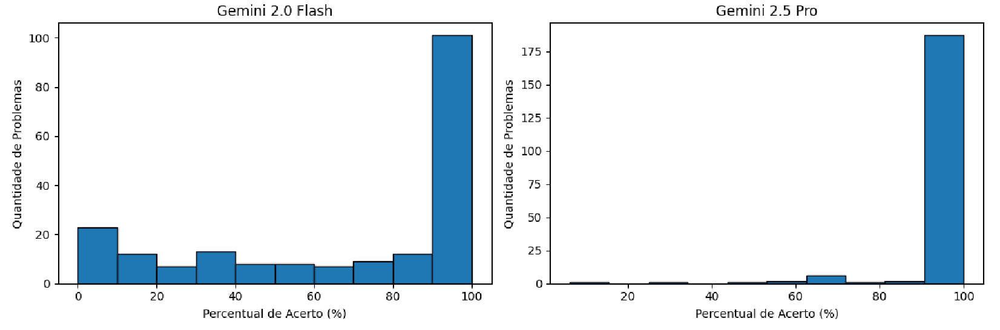
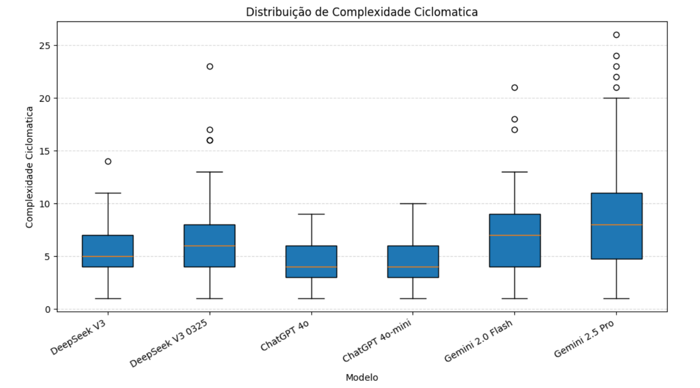
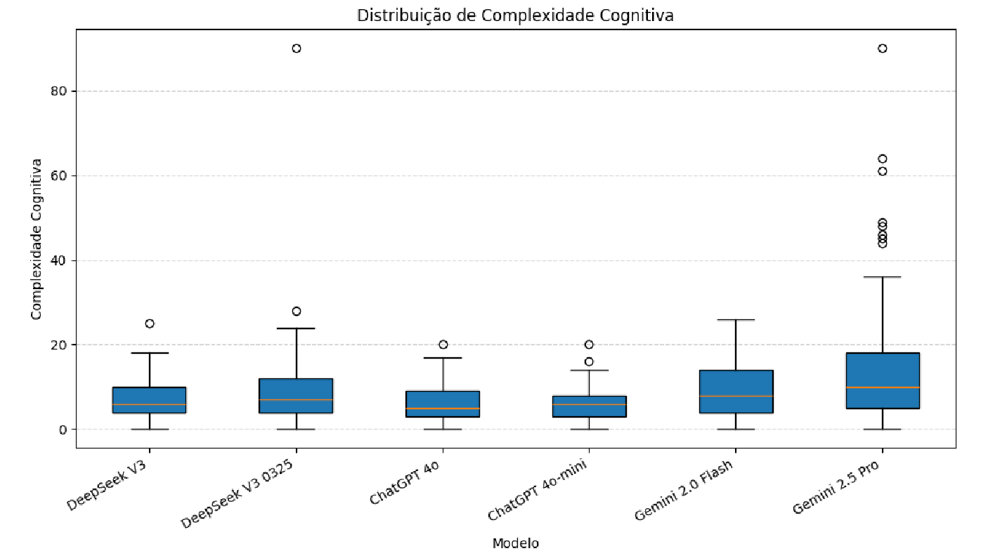

---
layout: section
index: "01"
title: Sobre Mim
---

---
layout: image
side: right
image: ./vertical_profile.png
title: Filipe Fernandes
---
**Pessoal:**
- Itaperuna/RJ
- Baterista que toca outros instrumentos
- Design Inteligente
- CEO de startup futura

**Profissional:**
- IF Sudeste MG - Campus Manhuaçu (out/2016 - Atual)
- Mestrado e Doutorado - COPPE/UFRJ (2014 - 2023)
- Pós-doutorado - UFMG (2025 - 2026)
- Especialista em Computação Quântica - SENAI/CIMATEC (2025 - 2026)

---
layout: image
side: right
image: ./quantum_metaverse.png
title: Atuação
---
- **Pesquisador**:
  - Quantum Software Engineering (QSE)
  - Metaverse Engineering
  - AI4SE e SE4AI

- **Coodenador de projetos de pesquisa:**
  - IF Sudeste MG
  - FAPEMIG

- Líder do **LIPES**

- **Steering Committee**: [I Workshop Brasileiro de Engenharia de Software Quântico (WQSE)](https://wqseworkshop.github.io/WQSE2026/organization.html)

- **Editor Assistente**: SBC Reviews

- **Comitê de programa**: conferências nacionais e internacionais

- **Revisor**: revistas científicas nacionais e internacionais

---
layout: section
index: "02"
title: Informações Gerais
---

---
layout: default
title: Sobre o Programa Analítico

---

- Art. 9º §2º \[...\] deverá ser feito pelos professores \[...\] levando-se em consideração o PPC, devendo conter [@RAG2018]:

|                                                                                                                                  |                                                                |
| -------------------------------------------------------------------------------------------------------------------------------- | -------------------------------------------------------------- |
| Curso, semestre letivo, disciplina, código, carga horária e pré-requisitos                                                       | Número de horas e aulas previstas por semestre                 |
| Período de execução e nome do(s) professor(es)                                                                                   | Metodologia                                                    |
| Ementa                                                                                                                           | Recursos didáticos                                             |
| Objetivos                                                                                                                        | Avaliação                                                      |
| Conteúdo programático discriminando a quantidade de aulas por conteúdo, separando as aulas teóricas e práticas, quando aplicável | Bibliografia básica (mínimo de 3) e complementar (mínimo de 5) |

---
title: Sobre o Programa Analítico
---
- Art. 9º §1º \[...\] deverá ser apresentado aos discentes **na primeira aula da disciplina** [@RAG2018]
- Art. 9 §3º \[...\] **poderão ser modificados** a partir de demandas identificadas no decorrer da disciplina [@RAG2018]

---
title: Informações do Curso
---

- Curso: Bacharelado em Sistemas de Informação
- Modalidade de oferta: Presencial
- Área de conhecimento: Computação
- Turno de oferta: Integral
- Número de períodos: 8

---
title: Regras para Aprovação ou Reprovação
---

Art. 37 [@RAG2018]

- **APROVADO**: nota da disciplina >= 6,0 **E** frequência >= 75%
- **REPROVADO**: nota da disciplina < 4,0 **OU** frequência < 75%
- **EXAME FINAL**: opcional ao discente com nota >= 4,0 **E** nota < 6,0 **E** frequência >= 75%

---
title: Regras para Frequência
---
- Art. 36. A frequência às aulas e as demais atividades acadêmicas serão obrigatórias [@RAG2018]
- §1º Casos aceitos para **abono de faltas**:
  - Alunos reservistas
  - Oficial ou Aspirante-a-Oficial da Reserva, convocado para o serviço ativo
  - Aluno com representação que tenha participado de reuniões da Comissão Nacional de Avaliação da Educação Superior – CONAES
- O registro da frequência é por aula (45min) e **não** por dia

---
layout: section
index: "03"
title: Informações da Disciplina

---

---
title: Informações da Disciplina
---

- Período: 6º semestre
- Natureza: obrigatória
- Código: INF03086
- Carga-horária: 60 horas
- Número de aulas: 80 aulas
- Pré-requisito: Engenharia de Software I

---
title: Por que estudar Engenharia de Software? (1)
kicker: Motivação
---
- Construir software de qualidade
- Desenvolver software sustentável
- Testar antes de entregar
- Facilitar manutenção
- Apoiar evolução contínua
- Atender às demandas do mercado

---
title: Objetivo
---

Capacitar o estudante a desenvolver software de qualidade por meio de testes, manutenção, evolução e gerenciamento de configuração.

---
title: Metodologia (1)
---
- **Preparação**: primeiros 15min
- **Aula**: restante do tempo 
- **Encerramento**: últimos 15min

---
title: Metodologia (2)
---
- Aulas Expositivas (TDH)
  - **T**eoria
  - **D**esenvolvimento
  - **H**ands-on
- Aprendizagem baseada em projetos (trabalho final)
- Avaliação manuscrita (papel e caneta)

---
title: Recursos Didáticos
---

- **Avisos, frequência e envio de atividades**: SIGAA
- **Materiais**: [https://filipefernandesphd.com/teaching](https://filipefernandesphd.com/teaching)
- **Recursos em sala de aula**: computador, datashow, lousa e pincéis, tablet, slides, vscode, dentre outros recursos digitais

---
title: Bibliografias
---

| Bibliografia Básica                                                                                                                                                              | Bibliografia Complementar                                                                                                                                                       |
| -------------------------------------------------------------------------------------------------------------------------------------------------------------------------------- | ------------------------------------------------------------------------------------------------------------------------------------------------------------------------------- |
| SOMMERVILLE, Ian. Engenharia de software. 9. ed. São Paulo: Pearson, 2011. 529 p. ISBN 978-85-7936-108-1.                                                                        | SBROCCO, José Henrique Teixeira de C.; MACEDO, Paulo Cesar D. Metodologias Ágeis - Engenharia de Software sob Medida. São Paulo: Editora Saraiva, 2012. E-book. ISBN 9788536519418.|
| PRESSMAN, Roger S.; MAXIM, Bruce R. Engenharia de software: uma abordagem profissional Porto Alegre: McGraw Hill / Bookman, 2021. E-book. ISBN 9786558040118.                    | LARMAN, Craig. Utilizando UML e Padrões. Porto Alegre: Bookman, 2011. E-book. ISBN 9788577800476. |
| VINCENZI, A. M. R. et al. Automatização de teste de software com ferramentas de software livre. Rio de Janeiro: Elsevier, 2018. 256 p. ISBN 978-8535287288.                      | DELAMARO, Marcio. Introdução ao Teste de Software. São Paulo: Grupo GEN, 2016. E-book. ISBN 9788595155732. 
|                                                                                                                                                                                  | SAITO, Danilo. DevOps na prática: entrega de software confiável e automatizada. 1. ed. São Paulo: Casa do Código , 2018. 283 p. ISBN 978-85-66250-40-4.|
|                                                                                                                                                                                  | SILVEIRA, Paulo et al. Introdução à arquitetura e design de software: uma visão sobre a plataforma Java. 1. ed. Rio de Janeiro: Elsevier , 2012. 257 p. ISBN 978-85-352-5029-9. |

---
title: Ementa
---
- Verificação, Validação e Teste de Software
- Evolução de Software
- Gerenciamento de Configuração de Software
- Manutenção de Software
- Qualidade de Software

---
title: Cronograma
---

Disponível em [https://filipefernandesphd.github.io/ESWII/2026.2/](https://filipefernandesphd.github.io/ESWII/2026.2/)

---
title: Atendimento
---
- Quintas-feiras de 13h às 17h
- Agendamento: [https://forms.gle/2VPe4UfohKUxa7Du9](https://forms.gle/2VPe4UfohKUxa7Du9)

---
title: Avaliações
---

- **Avaliação 1**: 2pts _(papel e caneta)_
- **Avaliação 2**: 2pts _(papel e caneta)_
- **Avaliação 3**: 2pts _(papel e caneta)_
- **Projeto Final**: 4pts

<i>Datas disponíveis em <a href="https://filipefernandesphd.github.io/ESWII/2026.2/" target="_blank">https://filipefernandesphd.github.io/ESWII/2026.2/</a></i>

---
layout: section
index: "04"
title: Projeto Final
---

---
title: Objetivos
---

- Dominar os conceitos de Engenharia de Software
- Aprender a utilizar LLMs de forma crítica e responsável
- Aplicar uma metodologia experimental simples para analisar evidências

---
title: Motivação
---

- IA na construção software é fato
- O ponto é: **"usar IA de forma consiente"**
- A régua aumentou:
  - Não aceitar a primeira resposta
  - Avaliar se a solução está correta
  - Segue boas práticas
  - Realmente resolve o problema

---
layout: quote
quote: Até que ponto podemos confiar nas LLMs para auxiliar no desenvolvimento de software?

---

---
layout: default
title: Formato

---

- Relatório Técnico: 3,5 pts
- Apresentação: 0,5 pt

---
title: Relatório Técnico (1)
---

- **Template**: [SBC em LaTeX](https://www.sbc.org.br/wp-content/uploads/2024/07/modelosparapublicaodeartigos.zip) (usar Overleaf)
- **Seções**: Resumo, Objetivo Geral e Específicos, Materiais e Métodos, Resultados, Discussão, Conclusão e Referências
- **LLMs**: mínimo de 3 LLMs
- **Tamanho mínimo da amostra**: 15 participantes, 30 códigos, 10 projetos em repositórios

---
title: Relatório Técnico (2)
---

- **Limite**: 10 a 12 páginas, além das referências
- **Acesso aos artefatos**: disponibilizar todos os artefatos utilizados em repositório do GitHub e citá-lo (com link) no relatório técnico
- **Entrega**: um arquivo **.zip** com
  - o projeto completo do Overleaf zipado
  - o projeto do GitHub zipado
  - o pdf da versão final do relatório

---
title: Apresentação
---

- Apresentação do trabalho
- Até 5 min

---
title: Escopo
---

- Tópicos relacionados com a ementa, mas não limitados a:
  - Qualidade de software
  - Refatoração de código
  - Code e test smells
  - Princípicos SOLID
  - Modelos de maturidade (CMMI e MPS.Br)
  - Verificação, validação e teste
  - Desenvolvimento dirigido por testes
  - Menutenção e evolução de software

<!-- ---
title: Exemplos
---
* Avaliação do Desempenho de LLMs na Conversão de Diagramas UML para Código Java
* Avaliação da Qualidade de Código Java Gerado por LLMs para Modelagem de Classes
* Um Estudo Comparativo sobre Encapsulamento em Código Java Gerado por LLMs
* Avaliação de LLMs na Implementação de Polimorfismo em Java -->

---
title: Sugestão
---

- Encontre um artigo no Google Scholar: _LLM/IA AND  code smells_
- Analise o método experimental: LLMs, métricas, ferramentas etc.
- Adapte para o escopo do trabalho
  - O método pode ser o mesmo, mas os materiais devem ser diferentes

---
layout: section
index: "05"
kicker: Exemplo
title: Avaliação de Qualidade de Código Java gerado por Large Language Models

---

---
kicker: Avaliação de Qualidade de Código Java gerado por Large Language Models
title:

---

- **Referência**: Oliveira et al. (2025) [@oliveria2025avaliacaoqualidadecodigo]
- **Objetivo**: investigar o impacto dos LLMs na qualidade do software gerado
- **Questões de Pesquisa**:
  - QP1: se existe diferença na **assertividade** dos códigos gerados por LLMs
  - QP2: se existe diferença na **complexidade ciclomática** dos códigos gerados por LLMs
  - QP3: se existe diferença na **complexidade cognitiva** dos códigos gerados por LLMs

---
kicker: Avaliação de Qualidade de Código Java gerado por Large Language Models
title: Material e Métodos

---

- 204 problemas de códigos extraídos da plataforma LeetCode
  - 56 fáceis; 104 médios; e 44 difíceis
- LeetCode e SonarQube para avaliação da qualidade do código
- LLMs: DeepSeek, ChatGPT e Gemini
- GitHub Models para acesso aos LLMs
- Tarefas automatizadas com Python e Selenium

---
kicker: Avaliação de Qualidade de Código Java gerado por Large Language Models
title: Prompts utilizados

---

---
kicker: Avaliação de Qualidade de Código Java gerado por Large Language Models
title:

---

# Resultado (QP1 - Assertividade)

---
kicker: Avaliação de Qualidade de Código Java gerado por Large Language Models
title:

---

# Resultado (QP1 - Assertividade)

---
kicker: Avaliação de Qualidade de Código Java gerado por Large Language Models
title:

---

# Resultado (QP1 - Assertividade)

---
kicker: Avaliação de Qualidade de Código Java gerado por Large Language Models
title:

---

# Resultado (QP2 - Complexidade Ciclomática)

---
kicker: Avaliação de Qualidade de Código Java gerado por Large Language Models
title:

---

# Resultado (QP3 - Complexidade Cognitiva)

---
kicker: Avaliação de Qualidade de Código Java gerado por Large Language Models
title: Discussão

---

- Gemini 2.5 Pro
  - Melhor desempenho em assertividade (82,35%)
  - Porém maior Complexidade Ciclomática e Cognitiva, e mais Code Smells
- Modelos do ChatGPT
  - Mais concisos
  - Complexidades e assertividades medianas

---
kicker: Avaliação de Qualidade de Código Java gerado por Large Language Models
title: Conclusão

---

- Gemini 2.5 Pro é melhor quando a assertividade é mais importante que a qualidade do código
- ChatGPT é melhor para entendimento e legibilidade do código

---
layout: section
index: "06"
title: Acordos Pedagógicos

---

---
title: Acordos Pedagógicos (1)
---
- **Respeito acima de tudo** [@regulamento_conduta_discente]:
  - Ao professor
  - Aos colegas da turma
  - Todos em geral

---
title: Acordos Pedagógicos (2)
---
- **Registro da frequência**:
  - **Obrigatoriamente** através da lista de presença
  - Bom senso na permanência em sala de aula

- **Aprovação**:
  - Conforme normas institucionais [@RAG2018]

---
title: Acordos Pedagógicos (3)
---
- **Reposições do curso (oferta integral)** [@PPCBSI2025]:
  - Período vespertino, conforme definido no [cronograma](https://filipefernandesphd.github.io/ESWII/2026.2/)

---
title: Acordos Pedagógicos (4)
---
- **Direitos e deveres do discente** [@regulamento_conduta_discente]:
  - Art. 15 inciso I: "*Conhecer e cumprir as diretrizes no Regulamento de Conduta Discente do IF Sudeste MG e demais regulamentos e normas institucionais*"
  - Art. 19: "*O ato de indisciplina se caracterizará pelo não cumprimento de um ou mais incisos constantes no *art. 15* ou a prática de um ou mais incisos constantes no art. 16*"

**Acesse o [Chatbot não oficial](https://filipefernandesphd.com/teaching) para obter mais informações**

---
title: Acordos Pedagógicos (5)
---

- **Materiais**:
  - Uso **obrigatório** dos materiais informados pelo professor

---
layout: section
index: "07"
title: Gravação das aulas
---

---
title: Gravação das aulas (1)
---
- Iniciativa **exclusivamente** do Prof. Filipe Fernandes

- Registro **exclusivamente** do Prof. Filipe Fernandes:
  - Tela do computador
  - Imagem e voz

- **A imagem, voz ou identificação dos estudantes não serão gravadas intencionalmente**

---
title: Gravação das aulas (2)
---

- **Objetivos**:
  - Produção de conteúdo educacional de autoria do Prof. Filipe Fernandes
  - Disponibilização de **material de apoio** para os estudantes da disciplina
    - Trasmissão ao vivo no [YouTube e outras plataformas](https://filipefernandesphd.com/)

---
title: Gravação das aulas (3)
---
- **IMPORTANTE!**
  * As transmissões ao vivo e as gravações são uma **iniciativa exclusiva do professor**, destinada ao apoio aos estudos e à produção de conteúdo educacional
  * **Não** configuram modalidade institucional de ensino
  * **Não** substituem as aulas presenciais
  * É **vedada** a utilização das transmissões ao vivo ou das gravações como justificativa para faltas às aulas presenciais

---
layout: default
title: Referências

---

<BiblioList />

---
layout: quote
quote: Não podemos voltar atrás e mudar o começo, mas podemos começar agora e mudar o final
author: C.S. Lewis
---

---
layout: feature
kicker: Encerramento
title: Obrigado!
columns: 2
features:

- { icon: "lucide:globe", desc: filipefernandesphd.com }
- { icon: "lucide:instagram", desc: "@filipfernandesphd" }

---

---
layout: two-cols
title: Avaliação da Experiência de Aprendizagem
---
- **[Seu feedback é muito importante!](https://forms.gle/CMfL5oTm235FfuH59)**
- Obtenha o código da avaliação
::right::

