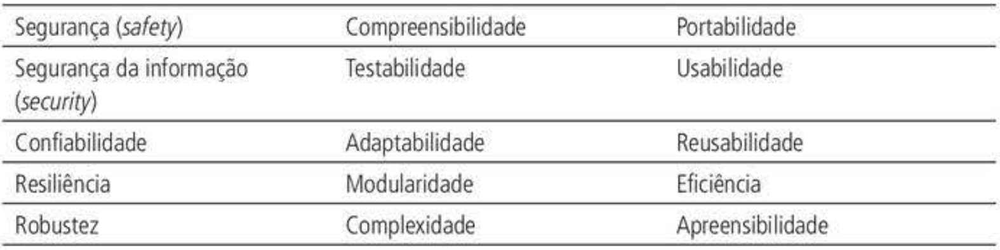
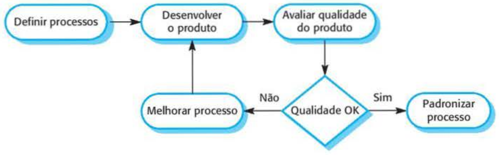

---
layout: section
title: Introdução
index: "01"
---
---
layout: bigtype
title: O que é <em>qualidade</em>?
---
---
layout: bigtype
title: O que é qualidade de <em>software</em>?
---
---
layout: default
title: Definição
---
> Garantir que o software atenda às **necessidades dos clientes**, seja executado de modo eficiente e confiável e seja entregue no **prazo e dentro do orçamento** [@SOMMERVILE2018]
---
layout: define
term: Como garantir que o software ...
points:
- Atenda às necessidades dos clientes?
- Seja executado de modo eficiente e confiável?
- Seja entregue no prazo e dentro do orçamento?
---
---
layout: define
term: "Resposta:"
points:
- Gerenciar a qualidade do software em aspecto organizacional e de projeto
---
---
layout: default
kicker: Gerenciamento da Qualidade
title: Aspecto organizacional
---
- Definir processos de desenvolvimento
- Padronizar formulários, estilos e formatos
- Definir procedimentos e documentação
---
layout: default
kicker: Gerenciamento da Qualidade
title: Aspecto de projeto
---
- Verificar a aplicação de processos e padrões
- Definir planos, metas e artefatos de qualidade
---
layout: default
title: Equipe
---
- Equipe capacitada:
  - Conferir padrões e metas organizacionais
  - Verificar tarefas registradas por cada equipe
  - Detectar esquecimentos e suposições incorretas
  - Gerenciar o processo de testes
---
layout: define
term: Quality Assurance (QA)
points:
- A equipe deve ser independente do desenvolvimento
- Assim, mantém uma visão objetiva da qualidade
---
---
layout: section
title: Qualidade de Software
index: "02"
---
---
layout: default
title: Quais atributos verificam a qualidade de uma régua?
---

---
layout: default
title: Quais atributos verificam se uma pintura é arte?
---

---
layout: vs
title: A natureza do produto muda a avaliação
left: { title: Produtos concretos, items: ["Qualidade objetiva"] }
right: { title: Produtos autorais ou abstratos, items: ["Qualidade subjetiva"] }
label: enquanto
---
---
layout: default
title: Software não é um objeto concreto
---
- Requisitos completos e inequívocos são difíceis
- Especificações cobrem somente parte dos stakeholders
- Algumas características são impossíveis de medir
- Manutenibilidade é um exemplo
---
layout: statement
kicker: Subjetividade
title: Avaliar a qualidade do software é um processo subjetivo?
---
---
layout: default
title: Perguntas para controlar a qualidade (1)
---
- O software foi devidamente testado?
- Todos os requisitos foram implementados?
- A confiabilidade permite colocá-lo em uso?
  - O que é _confiabilidade_?
---
layout: default
title: Perguntas para controlar a qualidade (2)
---
- O desempenho é aceitável no uso normal?
- O software é usável, estruturado e compreensível?
- Padrões de programação e documentação foram seguidos?
---
layout: default
title: Atributos de Qualidade
---
- Qualidade inclui atributos **não funcionais** do sistema.

---
layout: default
title: Qualidade baseada em processos
---
- O processo influencia significativamente a qualidade
- Bons processos favorecem software de boa qualidade

---
layout: default
title: Referências
---
<BiblioList />
---
layout: feature
kicker: Encerramento
title: Obrigado!
columns: 2
features:
- { icon: "lucide:globe", desc: filipefernandesphd.com }
- { icon: "lucide:instagram", desc: "@filipfernandesphd" }
---
---
layout: two-cols
title: Avaliação da Experiência de Aprendizagem
---
- **[Seu feedback é muito importante!](https://forms.gle/CMfL5oTm235FfuH59)**
- Obtenha o código da avaliação
::right::

