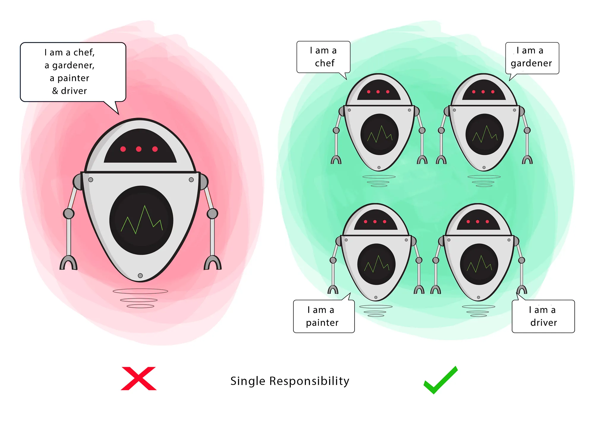
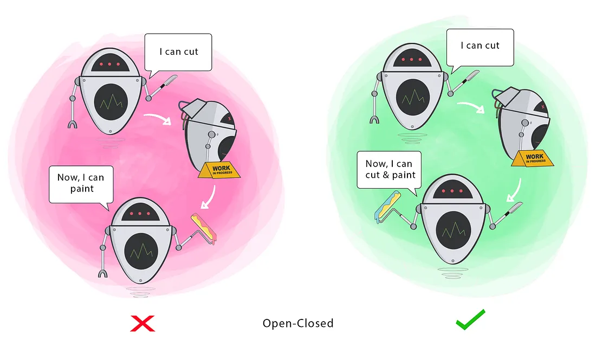
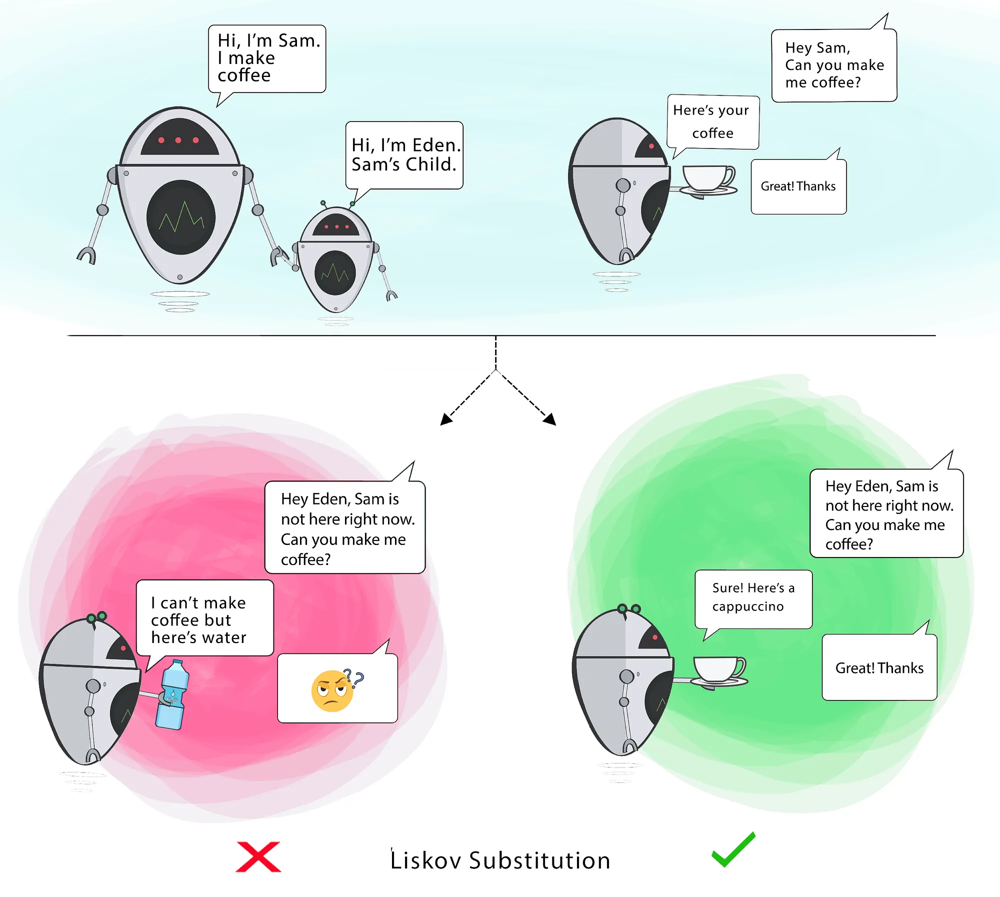
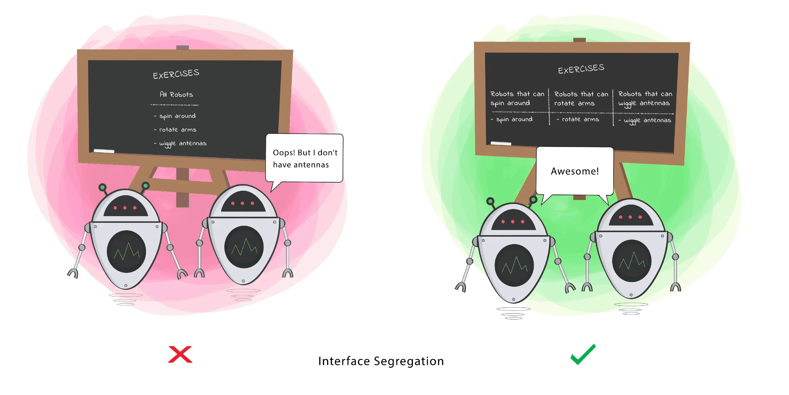
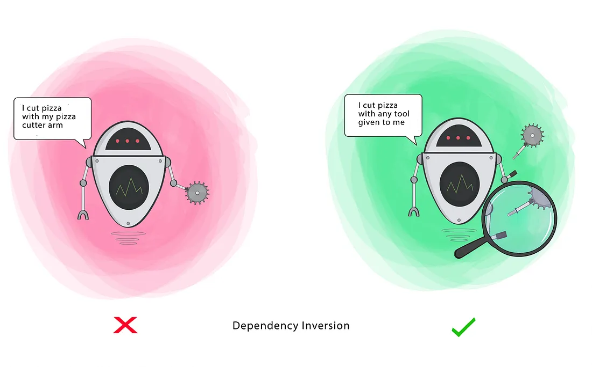

---
layout: default
title: História do SOLID
---
- Conceito criado por **Robert C. Martin (Uncle Bob)** em 2000;
- Popularizado no livro _Agile Software Development: Principles, Patterns, and Practices_ (2002);
- Sigla **SOLID** cunhada por **Michael Feathers**, reunindo cinco princípios;
---
layout: default
title: Motivação e Objetivo
---
- O objetivo dos princípios SOLID é **melhorar a qualidade do design de software**, tornando-o mais modular, compreensível e fácil de manter;
- Esses princípios ajudam a evitar **designs rígidos, frágeis ou complexos**;
- SOLID permite maior **flexibilidade** na evolução do código, facilitando modificações e minimizando os riscos de introdução de erros.
---
layout: default
title: Princípios SOLID
---
| **Sigla** | **Termo em Inglês**                   | **Tradução**                         |
| --------- | ------------------------------------- | ------------------------------------ |
| **S**     | Single Responsibility Principle (SRP) | Princípio da Responsabilidade Única  |
| **O**     | Open/Closed Principle (OCP)           | Princípio Aberto/Fechado             |
| **L**     | Liskov Substitution Principle (LSP)   | Princípio de Substituição de Liskov  |
| **I**     | Interface Segregation Principle (ISP) | Princípio da Segregação de Interface |
| **D**     | Dependency Inversion Principle (DIP)  | Princípio da Inversão de Dependência |
---
layout: default
title: S — Single Responsibility
---
- **Objetivo:** Uma classe deve ter uma única responsabilidade ou motivo para mudar (**coesa**);
- **Problema que resolve:** Evita que classes tenham múltiplas responsabilidades, o que aumenta a complexidade e dificulta a manutenção e evolução do código.
---
layout: default
---

<div class="h-[88%] flex items-center justify-center">
  
</div>

[@thelma2020solid]
---
layout: default
title: Contraexemplo
---
```java[font=normal]
// Classe com múltiplas responsabilidades
public class Relatorio {
    public void gerarPDF() {
        // Código para gerar PDF
    }
    public void salvarNoBanco() {
        // Código para salvar no banco
    }
}
```
---
layout: default
title: Exemplo
---
```java[font=normal]
// SRP aplicado: Separação de responsabilidades
public class RelatorioPDF {
    public void gerarPDF() {
        // Código para gerar PDF
    }
}

public class RelatorioRepository {
    public void salvarNoBanco() {
        // Código para salvar no banco
    }
}
```
---
layout: default
title: Vantagens
---
Aplicar o **S - Single Responsibility** ajuda:

- Reuso de código;
- Refatoração de código;
- Criação de testes automatizados;
- Gerar menos bugs;
- Menos esforço na compreensão de software, etc.
---
layout: default
title: O — Open-Closed
---
- **Objetivo:** Um software deve ser aberto para extensão, mas fechado para modificação;
- **Problema que resolve:** proporciona a construção de classes flexíveis e extensíveis, capazes de se adaptarem a diversos cenários de uso, sem modificações no seu código fonte e aumentar a probabilidade de introduzir bugs.
---
layout: default
---

<div class="h-[88%] flex items-center justify-center">
  
</div>

[@thelma2020solid]
---
layout: default
title: Contraexemplo
---
```java
class Shape {
    private String type;

    public void draw() {
     if (type.equals("rectangle")) {
         drawRectangle();
     } else if (type.equals("triangle")) {
         drawTriangle();
     }
    }

    private void drawRectangle() {
     // Desenhar um retângulo
    }

    private void drawTriangle() {
     // Desenhar um triângulo
    }
}
```
---
layout: default
title: Exemplo
---
```java
interface Shape {
    void draw();
}

class Rectangle implements Shape {
    public void draw() {
        // Desenhar um retângulo
    }
}

class Triangle implements Shape {
    public void draw() {
        // Desenhar um triângulo
    }
}
```
---
layout: default
title: Vantagens
---
Aplicar o **O - Open-Closed** ajuda:

- Extensão de funcionalidades;
- Preservar código já testado;
- Reduzir introdução de bugs;
- Reuso de componentes existentes;
- Maior flexibilidade do sistema;
- Facilidade de manutenção.
---
layout: default
title: L — Liskov Substitution
---
- **Objetivo:** Subclasses devem ser substituíveis por suas superclasses sem que o comportamento do programa seja alterado;
- **Problema que resolve:** Evita que subclasses alterem o comportamento esperado, garantindo que as heranças sejam adequadas.
---
layout: default
---

<div class="h-[88%] flex items-center justify-center">
  
</div>

[@thelma2020solid]
---
layout: default
title: Contraexemplo
---
```java
// Exemplo sem LSP: Subclasse altera o comportamento da superclasse
class Ave {
    public void voar() {
        System.out.println("Estou voando!");
    }
}

class Pinguim extends Ave {
    @Override
    public void voar() {
        throw new UnsupportedOperationException("Pinguins não voam!");
    }
}
```
---
layout: default
title: Exemplo
---
```java
// LSP aplicado: Voar é abstraído corretamente
interface Ave {
    void emitirSom();
}

interface AveQueVoa extends Ave {
    void voar();
}

class Andorinha implements AveQueVoa {
    public void emitirSom() { System.out.println("Pru pru! "); }
    public void voar() { System.out.println("Estou voando!"); }
}

class Pinguim implements Ave {
    public void emitirSom() { System.out.println("Grunt grunt!"); }
}
```
---
layout: default
title: Vantagens
---
Aplicar o **L - Liskov Substitution** ajuda:

- Uso seguro de herança;
- Maior previsibilidade do sistema;
- Evitar comportamentos inesperados;
- Reduzir erros em polimorfismo;
- Reuso de classes de forma consistente;
- Facilitar testes automatizados.
---
layout: default
title: I — Interface Segregation
---
- **Objetivo:** Os clientes não devem ser forçados a depender de interfaces que não utilizam;
- **Problema que resolve:** Evita que classes implementem métodos desnecessários, promovendo interfaces específicas que atendem apenas às necessidades do cliente.
---
layout: default
---

<div class="h-[88%] flex items-center justify-center">
  
</div>

[@thelma2020solid]
---
layout: default
title: Contraexemplo
---
```java
// Interface com métodos que nem todos os clientes precisam
public interface Trabalhador {
    void trabalhar();
    void fazerPausa();
    void receberSalario();
}

public class Estagiario implements Trabalhador {
    public void trabalhar() { /* Implementação */ }
    public void fazerPausa() { /* Implementação */ }
    public void receberSalario() {
        // Estagiários não recebem salário fixo, mas têm que implementar esse método
        throw new UnsupportedOperationException("Estagiário não recebe salário");
    }
}
```
---
layout: default
title: Exemplo
---
```java
// ISP aplicado: Interfaces específicas para cada função
public interface Trabalhador {
    void trabalhar();
}

public interface Remuneravel {
    void receberSalario();
}

public class Estagiario implements Trabalhador {
    public void trabalhar() { /* Implementação */ }
}

public class Funcionario implements Trabalhador, Remuneravel {
    public void trabalhar() { /* Implementação */ }
    public void receberSalario() { /* Implementação */ }
}
```
---
layout: default
title: Vantagens
---
Aplicar o **I - Interface Segregation** ajuda:

- Evitar interfaces gordas;
- Reduzir código não utilizado;
- Diminuir dependências desnecessárias;
- Facilitar implementação de classes;
- Aumentar clareza do design;
- Melhorar manutenibilidade.
---
layout: default
title: D — Dependency Inversion
---
- **Objetivo:** Ter classes que são coesas e **pouco acopladas**
- **Problema que resolve:** Evita dependências rígidas entre módulos e permite que detalhes de implementação sejam trocados facilmente sem alterar o código de alto nível;
- **Dica: prefira interfaces a classes.**
---
layout: default
---

<div class="h-[88%] flex items-center justify-center">
  
</div>

[@thelma2020solid]
---
layout: default
title: Contraexemplo
---
```java
// Módulo de ALTO nível acoplado ao detalhe:
class ControladorApresentacao {
    private final ProjetorHdmi projetor = new ProjetorHdmi(); // new direto = acoplamento

    public void iniciar() {
        projetor.ligar();
        projetor.selecionarEntradaHdmi(1);
    }

    public void exibirSlide(byte[] imagem) {
        projetor.renderizarImagem(imagem);
    }

    public void finalizar() {
        projetor.desligar();
    }
}

// Detalhe de BAIXO nível:
class ProjetorHdmi {
    void ligar() { /* ... */ }
    void selecionarEntradaHdmi(int porta) { /* ... */ }
    void renderizarImagem(byte[] img) { /* ... */ }
    void desligar() { /* ... */ }
}
```
---
layout: two-cols
title: Exemplo
class: dip-example
---
```java
// Abstração estável (contrato):
interface Projetor {
    void ligar();
    void exibir(byte[] imagem);
    void desligar();
}

// Implementações de baixo nível:
class ProjetorHdmi implements Projetor {
    public void ligar() { /* ... */  }
    public void exibir(byte[] imagem) { /* ... */  }
    public void desligar() { /* ... */ }
}

class ProjetorWifi implements Projetor {
    public void ligar() { /* ... */  }
    public void exibir(byte[] imagem) { /* ... */  }
    public void desligar() { /* ... */ }
}
```

::right::

```java
// Módulo de alto nível depende da ABSTRAÇÃO:
class ControladorApresentacao {
    private final Projetor projetor; // depende do contrato

    public ControladorApresentacao(Projetor projetor) { // injeção por construtor
        this.projetor = projetor;
    }

    public void iniciar() {
        projetor.ligar();
    }

    public void exibirSlide(byte[] imagem) {
        projetor.exibir(imagem);
    }

    public void finalizar() {
        projetor.desligar();
    }
}
```
---
layout: default
title: Vantagens
---
Aplicar o **D - Dependency Inversion** ajuda:

- Reduzir acoplamento;
- Facilitar substituição de componentes;
- Aumentar testabilidade com mocks/stubs;
- Melhorar reuso de módulos;
- Tornar o sistema mais flexível;
- Favorecer manutenção e evolução.


---
layout: default
title: Referências
---

<BiblioList />

---
layout: feature
kicker: Encerramento
title: Obrigado!
columns: 2
features:

- { icon: "lucide:globe", desc: filipefernandesphd.com }
- { icon: "lucide:instagram", desc: "@filipfernandesphd" }
---
---
layout: two-cols
title: Avaliação da Experiência de Aprendizagem
---
- **[Seu feedback é muito importante!](https://forms.gle/CMfL5oTm235FfuH59)**
- Obtenha o código da avaliação

::right::


