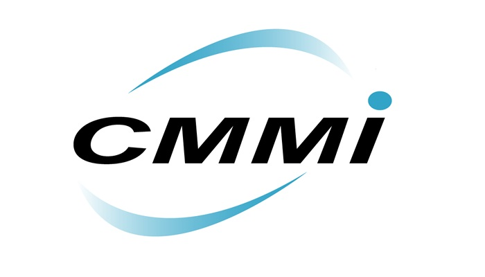
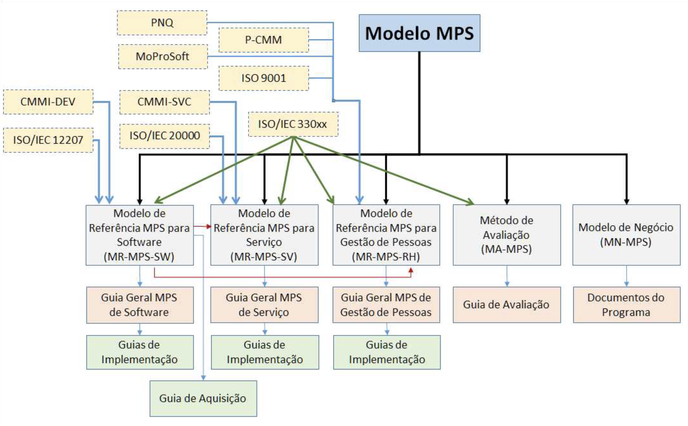
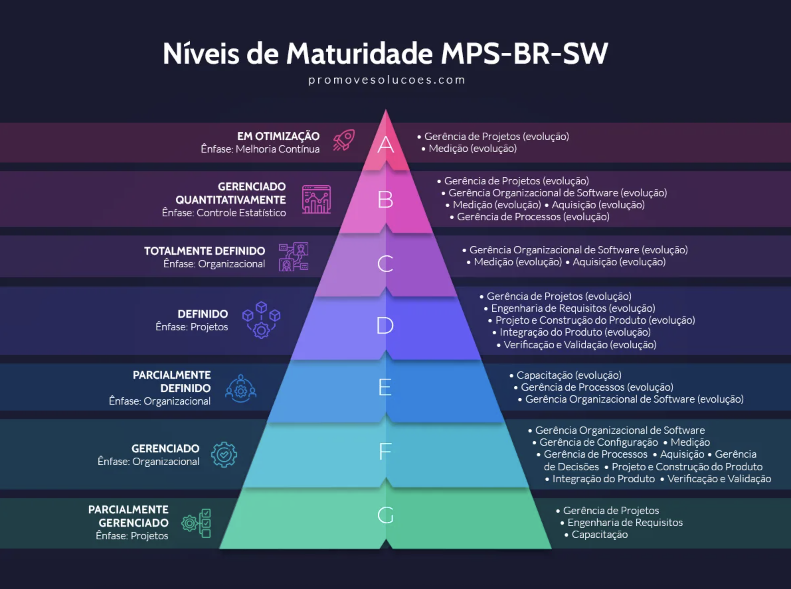
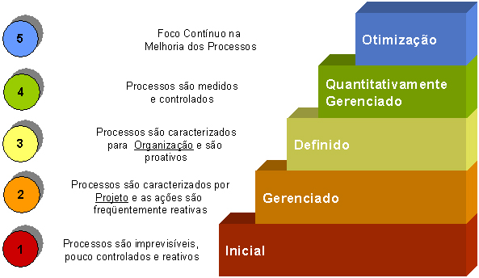

---
layout: default
title: Cenário — SoftSolutions
---

- Empresa de médio porte que desenvolve sistemas sob demanda;
- 10 anos de mercado, atende principalmente órgãos públicos e pequenas empresas;
- Recentemente perdeu contratos importantes por problemas de qualidade e atrasos.

---
layout: default
title: Principais Problemas
---

- Prazos de entrega frequentemente não cumpridos;
- Requisitos pouco documentados e mudanças constantes;
- Falta de padronização no desenvolvimento e testes;
- Retrabalho elevado e erros em produção;
- Ausência de métricas para monitorar desempenho.

---
layout: default
title: Impactos para a SoftSolutions
---

- Perda de contratos importantes;
- Desmotivação da equipe de desenvolvimento;
- Clientes insatisfeitos;
- Redução da competitividade no mercado.

---
layout: default
title: Reflexão
---

  

    Como a SoftSolutions pode estruturar seus processos para reduzir atrasos, evitar retrabalho e aumentar a competitividade?
  

---
layout: default
title: Solução
---

  

    Adotar <strong>práticas organizadas</strong> de trabalho que ajudam a melhorar seus processos de forma gradual e alinhada a padrões de qualidade reconhecidos.
  

---
layout: two-cols
title: Modelos de Maturidade
---

  

::right::

  

---
layout: default
title: MPSBR
---

- **MPSBR — Melhoria de Processo do Software Brasileiro** [@softex2024]
- Criado em dezembro de 2003 e coordenado pela Associação para Promoção da Excelência do Software Brasileiro (SOFTEX).
- O MPSBR é um programa mobilizador, cujo objetivo é apoiar o aumento da competitividade das organizações por meio da **melhoria de seus processos**.

---
layout: default
title: Metas
---

# Metas Técnicas
# Metas de Negócio

---
layout: default
kicker: Metas
title: Metas Técnicas
---

Visando ao aprimoramento do programa:

- Atualização dos modelos e guias *(representantes de universidades, instituições governamentais, centros de pesquisa e organizações privadas)*;
- Formação de consultores, instrutores de cursos, avaliadores e Instituições Implementadoras/Avaliadoras.

---
layout: default
kicker: Metas
title: Metas de Negócio
---

Visando à disseminação e viabilização na adoção dos Modelos de Maturidade:

- Criação e aprimoramento do modelo de negócio MN-MPS;
- Realização de cursos, provas e workshops MPS *(ex.: WAMPS e Softwex Experience)*;
- Transparência para as organizações que realizaram a avaliação MPS.

---
layout: default
title: Objetivos
---

- **Adequados ao perfil de empresas**, com especial atenção às **micro, pequenas e médias empresas** (mPME)

- **Compatíveis com os padrões de qualidade aceitos internacionalmente**.

---
layout: default
title: Base Técnica
---

  

---
layout: default
title: Componentes
---

- Cada componente é descrito por meio de guias e/ou documentos do Programa MPS.BR.

---
title: Componentes
---

- O Programa MPSBR possui 5 componentes:
  - **MR-MPS-SW: Modelo de Referência MPS para Software**
  - MR-MPS-SV: Modelo de Referência MPS para Serviços
  - MR-MPS-RH: Modelo de Referência MPS para Gestão de Pessoas
  - MA-MPS: Método de Avaliação
  - MN-MPS: Modelo de Negócio

---
layout: default
---

  

---
layout: default
title: MR-MPS-SW
---

- MR-MPS-SW define **níveis de maturidade** que são uma combinação entre **23 processos** e sua **capacidade**;

---
layout: default
kicker: MR-MPS-SW
title: Processos
---

- Os processos estão divididos em dois conjuntos:
  - **Processos de projeto:** executados para os projetos de software;
  - **Processos organizacionais:** executados para atendar às expectativas e necessidades das partes interessadas.

---
layout: default
kicker: MR-MPS-SW
title: Resultados Esperados
---

- Cada processo possui um propósito e **resultados esperados** de sua execução;
- **Os resultados são acumulativos**, ou seja, os resultados que aparecem no nível G deverão estar presentes, com as mesmas características ou com evoluções, no nível F e acima.

---
layout: default
title: Atenção!
---

- As *atividades e tarefas* necessárias para atender ao propósito e aos *resultados esperados* **NÃO** são definidas no guia;
- Fica a cargo dos usuários do MR-MPS-SW definir como atender aos resultados esperados;

---
layout: default
---
# MR-MPS-SW define <em>o que</em> deve ser implementado e <em>não como</em> implementar.

---
layout: default
title: Resumo da Estrutura
---

- **Nível de Maturidade**
  - **Capacidade do Processo**
    - **Resultados**
    - **Processos (de Projeto e Organizacionais)**
      - **Propósito**
      - **Resultados Esperados**

---
layout: section
index: "Exemplo"
title: Nível de Maturidade G
---

---
kicker: Exemplo - Nível de Maturidade G
title: Capacidade do Processo
---
A execução do processo é gerenciada (CP-G)

---
kicker: Exemplo - Nível de Maturidade G
title: Resultados
---
- O processo produz os resultados definidos;
- A execução do processo é planejada e monitorada;
- As pessoas estão preparadas para executar suas responsabilidades no processo.

---
kicker: Exemplo - Nível de Maturidade G
title: Processos
---
- Gerência de Projetos (GPR)
- Engenharia de Requisitos (REQ)
- Capacitação (CAP)

---
kicker: Exemplo - Nível de Maturidade G
title: Processo -> Gerência de Projetos (GPR)
---
- **Propósito:** estabelecer e manter atualizados planos que definam as atividades do processo, bem como prover informações sobre o andamento do projeto.
- **Resultados Esperados:** 23

---
kicker: Exemplo - Nível de Maturidade G
title: Processo -> Engenharia de Requisitos (REQ)
---
- **Propósito:** definir, gerenciar e manter atualizados os requisitos das partes interessadas e do produto.
- **Resultados Esperados:** 7

---
kicker: Exemplo - Nível de Maturidade G
title: Processo -> Capacitação (CAP)
---
- **Propósito:** prover a organização com recursos humanos com as competências adequadas às necessidades do negócio.
- **Resultados Esperados:** 4

---
layout: section
index: "CMMI"
title: Capability Maturity Model Integration
---

---
layout: default
title: CMMI — Visão Geral
---

- Conjunto de melhores práticas para melhoria de processos.
- Criado pelo SEI (Software Engineering Institute) da Carnegie Mellon University.
- Aplicável a desenvolvimento de software, serviços e aquisição.

---
layout: default
title: Objetivos do CMMI
---

- Aumentar a capacidade das organizações de entregar produtos/serviços de qualidade.
- Reduzir riscos de custo, prazo e qualidade.
- Prover um modelo de referência compatível com padrões internacionais.

---
layout: default
title: Estrutura do CMMI
---

- Organizado em **áreas de processo**, agrupadas em categorias:
  - **Gestão de Projetos**
  - **Engenharia**
  - **Suporte**
  - **Gestão de Processos**
- Define práticas esperadas para alcançar objetivos de negócio.

---
layout: default
title: Níveis de Maturidade
---

  

---
layout: default
title: CMMI na Prática
---

- Fornece um caminho evolutivo para melhoria de processos.
- Facilita certificações e competitividade no mercado.
- Inspirou programas nacionais como o MPS.BR.

---
layout: default
title: Referências
---
<BiblioList />

---
layout: feature
kicker: Encerramento
title: Obrigado!
columns: 2
features:

- { icon: "lucide:globe", desc: filipefernandesphd.com }
- { icon: "lucide:instagram", desc: "@filipfernandesphd" }

---

---
layout: two-cols
title: Avaliação da Experiência de Aprendizagem
---

- **[Seu feedback é muito importante!](https://forms.gle/CMfL5oTm235FfuH59)**
- Obtenha o código da avaliação

::right::

