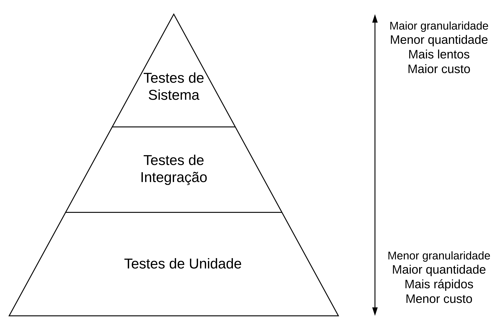
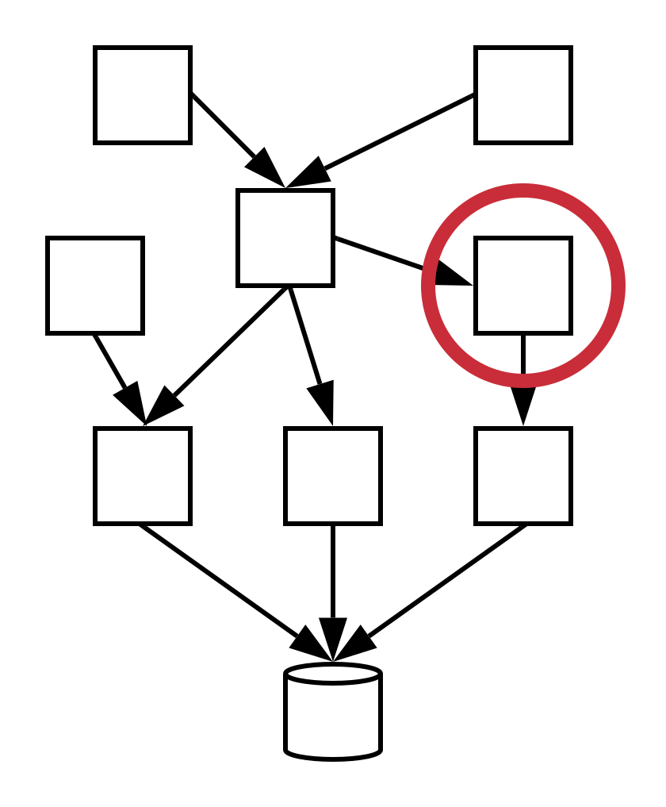
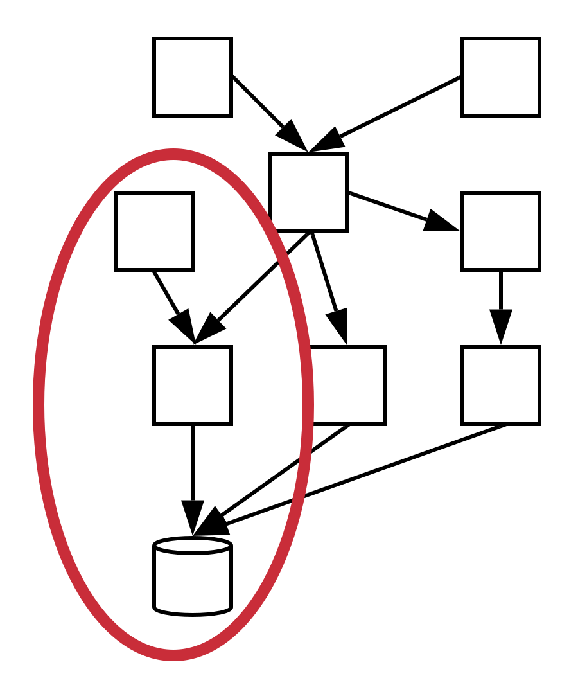
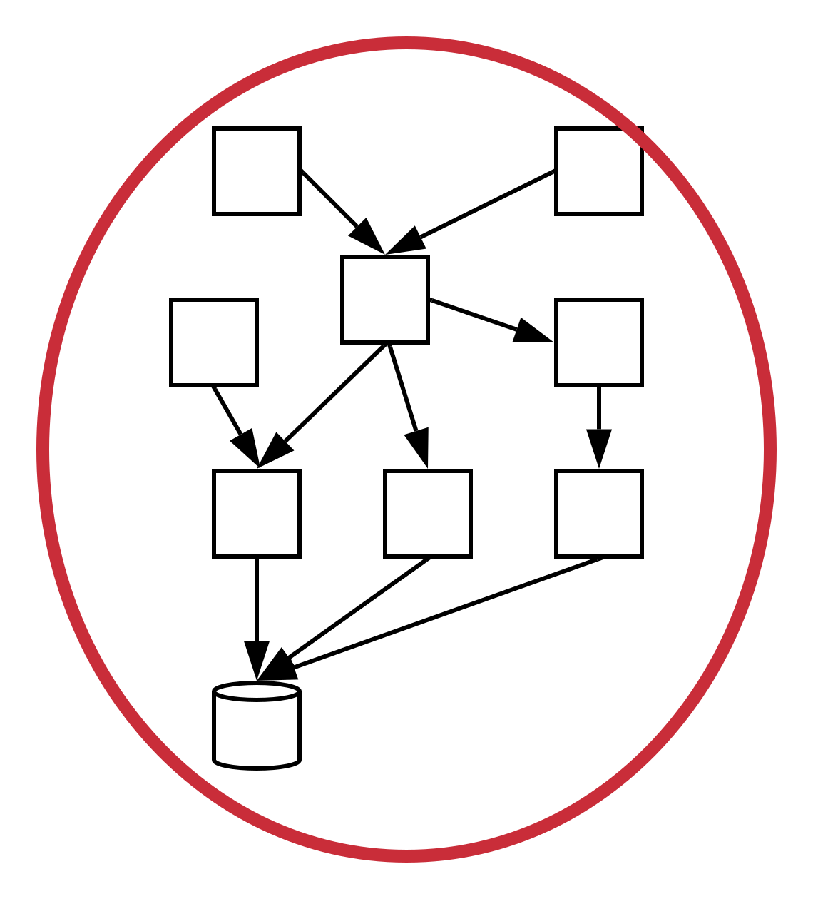
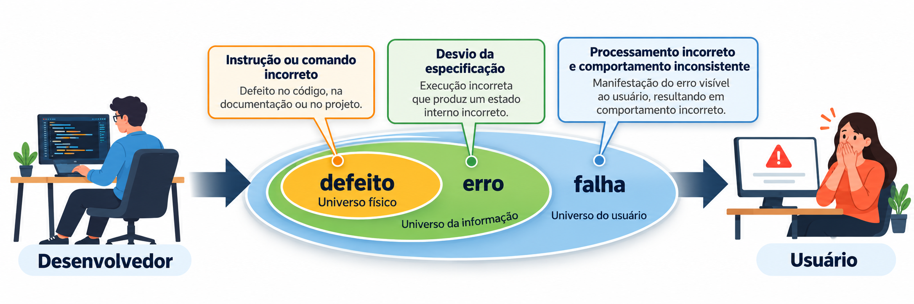
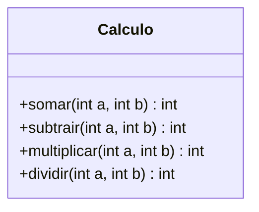

---
layout: section
index: "T"
title: Teoria
---

---
layout: section
index: "01"
title: Introdução
---

---
layout: default
title: Software é complexo
---

- Software é complexo de desenvolver e manter;
- Por isso, está sujeito a erros e inconsistências.

---
layout: statement
title: Como evitar <span class="accent2">erros</span>?
---

---
layout: define
kicker: Introdução
term: Teste de Software
definition: Atividade que executa um programa, ou partes dele, com dados de entrada e verifica se as saídas produzidas são as <span class="accent2">esperadas</span>.
points:
  - Objetivo — evitar que erros cheguem aos usuários finais
---

---
layout: statement
kicker: Michael Feathers
title: Se um código não é acompanhado de testes, ele pode ser considerado de <span class="accent2">baixa qualidade</span> ou até mesmo um <span class="accent2">código legado</span>.
---

---
layout: default
title: Formas de executar testes
---

- **Manual:** mais trabalho, mais demorado e mais caro;
- **Automatizado:** código que testa o código; rápido e repetível a cada modificação.

---
layout: section
index: "02"
title: Tipos de Testes
---

---
layout: default
title: Classificação de testes
---

<div class="h-[100%] flex items-center justify-center">
  
</div>

---
layout: two-cols
title: Teste de Unidade
---

- Verificam pequenas partes do sistema (ex.: uma classe);
- Mais simples de implementar e executam mais rápido.

::right::

<div class="h-[100%] flex items-center justify-center">
  
</div>

---
layout: two-cols
title: Teste de Integração
---

- Também conhecido como **Teste de Serviços**;
- Verificam uma funcionalidade ou transação completa do sistema (várias classes, pacotes...);
- Exigem mais esforço de implementação e são mais demorados para executar.

::right::

<div class="h-[100%] flex items-center justify-center">
  
</div>

---
layout: two-cols
title: Teste de Sistema
---

- Também conhecido como **Teste de Interface com o Usuário** ou **ponta a ponta** (*end-to-end*);
- Simula, de forma mais fiel, uma sessão de uso do sistema por um usuário real;
- Mais caros e mais lentos.

::right::

<div class="h-[100%] flex items-center justify-center">
  
</div>

---
layout: default
title: Vocabulário
---

<div class="h-[100%] flex items-center justify-center">
  
</div>

---
layout: section
index: "D"
title: Desenvolvimento
---

---
layout: diagram
kicker: Desenvolvimento
title: Classe <span class="accent2">Calculo</span>
---



---
layout: default
kicker: Desenvolvimento
title: Implementação da classe Calculo
---

```java[font=large]
public class Calculo {

    public int somar(int a, int b) {
        return a + b;
    }

    public int subtrair(int a, int b) {
        return a - b;
    }

    public int multiplicar(int a, int b) {
        return a * b;
    }

    public int dividir(int a, int b) {
        return a / b;
    }
}
```

---
layout: default
kicker: Desenvolvimento
title: Nosso <span class="accent2">assertEqual</span>
---

```java[font=large]
public class Assert {

    public static void assertEqual(
            int esperado, int obtido, String descricao) {
        if (esperado == obtido) {
            System.out.println("PASSOU: " + descricao);
        } else {
            System.out.println("FALHOU: " + descricao
                + " | esperado: " + esperado
                + " | obtido: " + obtido);
        }
    }
}
```

---
layout: two-cols
kicker: Método 1 de 4
title: somar
---

```java[font=normal]
public int somar(int a, int b) {
    return a + b;
}
```

::right::

```java[font=normal]
Calculo calculo = new Calculo();

Assert.assertEqual(5,
    calculo.somar(2, 3),
    "2 + 3 = 5");

Assert.assertEqual(-1,
    calculo.somar(2, -3),
    "2 + (-3) = -1");

Assert.assertEqual(4,
    calculo.somar(4, 0),
    "4 + 0 = 4");
```

---
layout: two-cols
kicker: Método 2 de 4
title: subtrair
---

```java[font=normal]
public int subtrair(int a, int b) {
    return a - b;
}
```

::right::

```java[font=normal]
Calculo calculo = new Calculo();

Assert.assertEqual(2,
    calculo.subtrair(5, 3),
    "5 - 3 = 2");

Assert.assertEqual(-2,
    calculo.subtrair(3, 5),
    "3 - 5 = -2");

Assert.assertEqual(7,
    calculo.subtrair(7, 0),
    "7 - 0 = 7");
```

---
layout: two-cols
kicker: Método 3 de 4
title: multiplicar
---

```java[font=normal]
public int multiplicar(int a, int b) {
    return a * b;
}
```

::right::

```java[font=normal]
Calculo calculo = new Calculo();

Assert.assertEqual(6,
    calculo.multiplicar(2, 3),
    "2 * 3 = 6");

Assert.assertEqual(-8,
    calculo.multiplicar(-2, 4),
    "-2 * 4 = -8");

Assert.assertEqual(0,
    calculo.multiplicar(9, 0),
    "9 * 0 = 0");
```

---
layout: two-cols
kicker: Método 4 de 4
title: dividir
---

```java[font=normal]
public int dividir(int a, int b) {
    return a / b;
}
```

::right::

```java[font=normal]
Calculo calculo = new Calculo();

Assert.assertEqual(5,
    calculo.dividir(10, 2),
    "10 / 2 = 5");

// divisão inteira
Assert.assertEqual(3,
    calculo.dividir(7, 2),
    "7 / 2 = 3");

Assert.assertEqual(-4,
    calculo.dividir(-8, 2),
    "-8 / 2 = -4");
```

---
layout: feature
kicker: Encerramento
title: Obrigado!
columns: 2
features:

- { icon: "lucide:globe", desc: filipefernandesphd.com }
- { icon: "lucide:instagram", desc: "@filipfernandesphd" }
---
---
layout: two-cols
title: Avaliação da Experiência de Aprendizagem
---
- **[Seu feedback é muito importante!](https://forms.gle/CMfL5oTm235FfuH59)**
- Obtenha o código da avaliação

::right::


