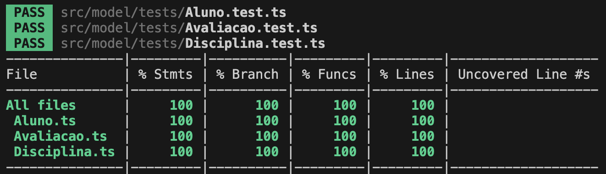

# Prova de Testes Unitários

- **AV3**
- Pontuação: 2pts
- Critérios:
    - 1,5pts dedicados à cobertura dos testes
        - Cálculo: serão considerados os resultados da cobertura de testes, conforme figura abaixo, e realizado cálculo

        $$ \left(\left(\frac{Stmts + Branch + Funcs + Lines}{4} \right)/100\right) * 1.5 $$

        <center>
        
        </center>

    - 0,5pts dedicados ao tratamento de possibilidades nos cenários de teste (ex: ao testar se uma data é válida, deve-se tratar as possibilidades de o usuário inserir somente letras, letras e números, mês no campo de dia e vice-versa, etc) 

## Observações

Não há limites de `expect()` nos cenários de testes. Por exemplo, ao validar uma data, você pode escrever o teste assim:
```javascript
// deve gerar uma exceção quando a data for inválida
it('deve gerar uma exceção quando a data for inválida', ()=>{
    expect( ()=>objeto.setData('aa/mm/yyyy') ).toThrow(/^A data deve ser válida!$/);
    expect( ()=>objeto.setData('aammyyyy') ).toThrow(/^A data deve ser válida!$/);
    expect( ()=>objeto.setData('aamm2024') ).toThrow(/^A data deve ser válida!$/);
    // etc...
});
```

Além disso, uma outra forma de tratar execeções no Jest foi apresentada acima. Onde está `objeto.setData()` mude pelo método que gerará exceção e entre `/^ $/` coloque exatamente a mensagem da exceção. 

## Documentação

O arquivo `./doc_jest.pdf` possui uma breve documentação do Jest.

## Comandos

- `npm install`: instalar pacotes
- `npm run test:coverage`: realizar cobertura de testes